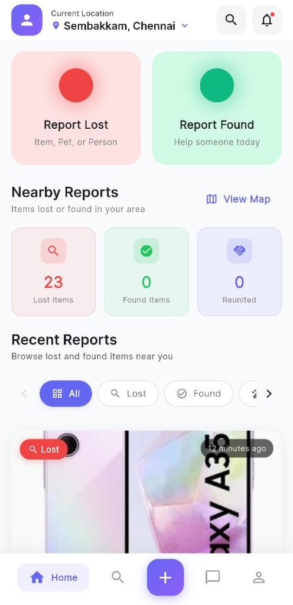
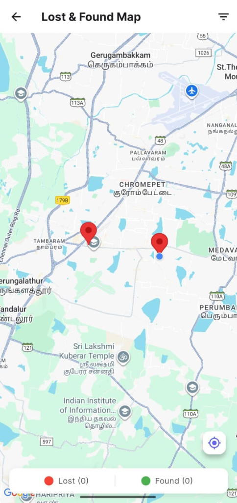
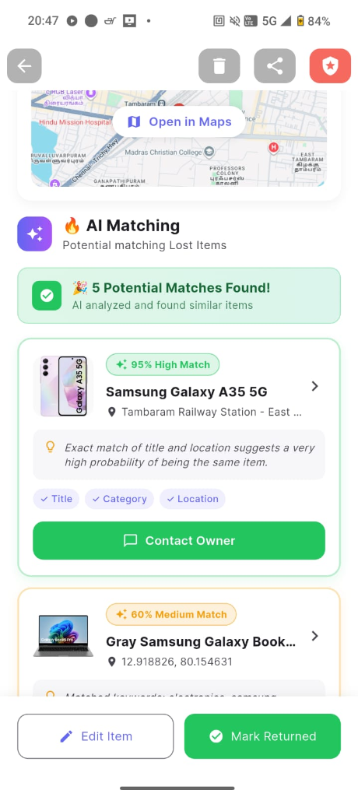
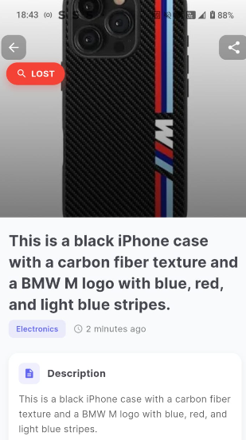
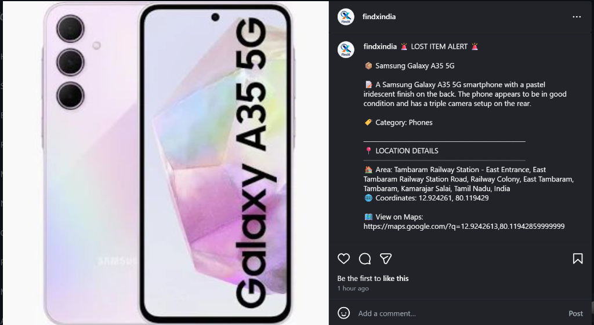
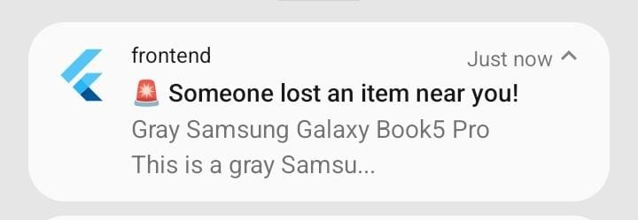
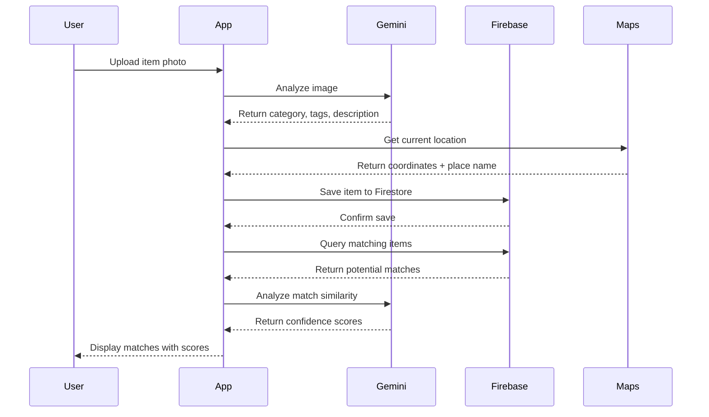

<p align="center">
  
</p>

<h1 align="center">🔍 FindX</h1>
<h3 align="center">AI-Powered Lost & Found Platform</h3>

<p align="center">
  <strong>Reuniting people with their lost belongings using the power of Google Gemini AI</strong>
</p>

<p align="center">
  
  
  
  
</p>

<p align="center">
  <a href="#-demo">Demo</a> •
  <a href="#-features">Features</a> •
  <a href="#-architecture">Architecture</a> •
  <a href="#-tech-stack">Tech Stack</a> •
  <a href="#-setup">Setup</a> •
  <a href="#-google-technologies">Google Tech</a>
</p>

---

## 🎯 Problem Statement

**Every year, millions of items are lost worldwide**, with an estimated **$30 billion+ in value** going unreturned. Traditional lost & found systems are:
- 📍 Location-limited (only work within a single organization)
- 🔍 Manually operated with no smart matching
- 📱 Not mobile-friendly
- 🔗 Disconnected from modern communication tools
- 🚔 No integration with authorities

**FindX solves this** with AI-powered item matching, real-time location tracking, and seamless police integration.

---

## 🚀 Demo

| 📱 Mobile App | 📊 Analytics Dashboard |
|---------------|------------------------|
| [Download APK](https://github.com/MUTHUKUMARAN-K-1/FIND-X-/releases) | [Live Dashboard](https://findx-dashboard.vercel.app) |

### Video Demo
▶️ [Watch Demo Video](https://drive.google.com/drive/folders/1JMCCAw2xpRtKJjiwLQ57Amkgi1Qtr4uc?usp=drive_link)

---

## 📸 Screenshots

<table>
  <tr>
    <td align="center"><b>🏠 Home Screen</b></td>
    <td align="center"><b>🗺️ Location Heatmap</b></td>
    <td align="center"><b>🤖 AI Matching</b></td>
    <td align="center"><b>✨ AI Analysis</b></td>
  </tr>
  <tr>
    <td></td>
    <td></td>
    <td></td>
    <td></td>
  </tr>
</table>

<table>
  <tr>
    <td align="center"><b>📸 Instagram Auto-Post</b></td>
    <td align="center"><b>🔔 Push Notification</b></td>
  </tr>
  <tr>
    <td></td>
    <td></td>
  </tr>
</table>

---

## ✨ Features

### 🤖 AI-Powered Features (Google Gemini)

| Feature | Description |
|---------|-------------|
| **Smart Item Analysis** | Gemini AI automatically identifies and categorizes items from photos |
| **AI Matching Engine** | Finds potential matches between lost and found items with confidence scores |
| **Voice-to-Text Reporting** | Report items using voice commands |
| **Natural Language Search** | Search using conversational queries |

### 📍 Location & Maps (Google Maps Platform)

| Feature | Description |
|---------|-------------|
| **Real-time Location Tracking** | Automatic location detection when reporting |
| **Nearby Alerts** | Push notifications for items found near you |
| **Location Heatmap** | Visualize hotspots for lost/found items |
| **Proximity Search** | Find items within a specific radius |

### 🔥 Firebase Integration

| Service | Usage |
|---------|-------|
| **Authentication** | Google Sign-In, Email/Password |
| **Cloud Firestore** | Real-time database for items, users, chats |
| **Cloud Storage** | Image storage with CDN delivery |
| **Cloud Messaging (FCM)** | Push notifications for matches and alerts |

### 👮 Police Integration (India)

| Feature | Description |
|---------|-------------|
| **Emergency Contacts** | One-tap dial to Police (100), Women Helpline (1091) |
| **State Portals** | Quick links to all 28 state police portals |
| **CEIR Integration** | Report lost mobile phones to national database |
| **FIR Draft Generator** | AI-generated First Information Report draft |

### 🏆 Gamification & Social

| Feature | Description |
|---------|-------------|
| **Karma Points System** | Earn points for reporting, finding, and returning items |
| **5 Achievement Levels** | Newcomer → Helper → Guardian → Hero → Legend |
| **Instagram Poster Generator** | Create shareable lost/found posters |
| **Real-time Chat** | Direct messaging between finders and owners |

---

## 🏗 Architecture

```
┌─────────────────────────────────────────────────────────────────────────┐
│                           FINDX ARCHITECTURE                             │
├─────────────────────────────────────────────────────────────────────────┤
│                                                                          │
│    ┌──────────────────┐     ┌──────────────────┐     ┌───────────────┐ │
│    │   Flutter App    │     │  Next.js         │     │    Admin      │ │
│    │   (Android/iOS)  │     │  Dashboard       │     │    Console    │ │
│    └────────┬─────────┘     └────────┬─────────┘     └───────┬───────┘ │
│             │                        │                        │         │
│             └────────────────────────┼────────────────────────┘         │
│                                      │                                   │
│                          ┌───────────▼───────────┐                      │
│                          │     Firebase Suite    │                      │
│                          └───────────┬───────────┘                      │
│                                      │                                   │
│    ┌─────────────────────────────────┼─────────────────────────────────┐│
│    │                                 │                                  ││
│    │  ┌──────────┐ ┌──────────┐ ┌────┴─────┐ ┌──────────┐ ┌──────────┐ ││
│    │  │   Auth   │ │Firestore │ │ Storage  │ │   FCM    │ │ Hosting  │ ││
│    │  └──────────┘ └──────────┘ └──────────┘ └──────────┘ └──────────┘ ││
│    │                                                                    ││
│    └────────────────────────────────────────────────────────────────────┘│
│                                      │                                   │
│                          ┌───────────▼───────────┐                      │
│                          │   Google Cloud APIs   │                      │
│                          └───────────┬───────────┘                      │
│                                      │                                   │
│    ┌─────────────────────────────────┼─────────────────────────────────┐│
│    │                                 │                                  ││
│    │  ┌──────────┐ ┌──────────┐ ┌────┴─────┐ ┌──────────┐              ││
│    │  │  Gemini  │ │  Maps    │ │ Places   │ │ Geocoding│              ││
│    │  │   AI     │ │Platform  │ │   API    │ │   API    │              ││
│    │  └──────────┘ └──────────┘ └──────────┘ └──────────┘              ││
│    │                                                                    ││
│    └────────────────────────────────────────────────────────────────────┘│
│                                                                          │
└─────────────────────────────────────────────────────────────────────────┘
```

### Data Flow



---

## 🛠 Tech Stack

### Mobile Application
| Technology | Purpose |
|------------|---------|
| **Flutter 3.10+** | Cross-platform UI framework |
| **Dart 3.0+** | Programming language |
| **flutter_bloc** | State management |
| **go_router** | Declarative navigation |

### Google Technologies ⭐
| Technology | Purpose | Integration Depth |
|------------|---------|-------------------|
| **Google Gemini AI** | Image analysis, matching, text generation | Core Feature |
| **Firebase Auth** | User authentication | Core Feature |
| **Cloud Firestore** | Real-time database | Core Feature |
| **Firebase Storage** | Image storage | Core Feature |
| **Firebase Cloud Messaging** | Push notifications | Core Feature |
| **Google Maps SDK** | Map visualization | Core Feature |
| **Google Places API** | Location autocomplete | Core Feature |
| **Geocoding API** | Reverse geocoding | Core Feature |

### Web Dashboard
| Technology | Purpose |
|------------|---------|
| **Next.js 14** | React framework |
| **Tailwind CSS** | Styling |
| **Chart.js** | Data visualization |
| **Vercel** | Hosting |

---

## 📁 Project Structure

```
FindX/
├── 📱 frontend/               # Flutter mobile app
│   ├── lib/
│   │   ├── api/              # Repository layer
│   │   ├── blocs/            # BLoC state management
│   │   ├── models/           # Data models
│   │   ├── screens/          # UI screens
│   │   │   ├── auth/         # Login, Register
│   │   │   ├── home/         # Main feed
│   │   │   ├── lost_item/    # Report lost item
│   │   │   ├── found_item/   # Report found item
│   │   │   ├── item_details/ # Item details + AI matching
│   │   │   ├── chat/         # Messaging
│   │   │   ├── profile/      # User profile + Karma
│   │   │   └── settings/     # App settings
│   │   ├── services/         # Business logic services
│   │   │   ├── gemini_service.dart      # Gemini AI
│   │   │   ├── ai_matching_service.dart # AI matching
│   │   │   ├── karma_service.dart       # Karma points
│   │   │   ├── police_service.dart      # Police integration
│   │   │   └── fcm_service.dart         # Push notifications
│   │   └── widgets/          # Reusable components
│   └── assets/               # Images, icons
│
├── 📊 dashboard/             # Next.js analytics dashboard
│   ├── app/
│   │   ├── page.tsx          # Main dashboard
│   │   ├── items/            # Items management
│   │   └── heatmap/          # Location heatmap
│   └── lib/
│       └── firebase.ts       # Firebase config
│
├── 🔒 firestore.rules        # Security rules
├── 📄 firebase.json          # Firebase config
└── 📖 README.md              # This file
```

---

## ⚙️ Setup Instructions

### Prerequisites
- Flutter 3.10+ ([Install](https://flutter.dev/docs/get-started/install))
- Node.js 18+ ([Install](https://nodejs.org))
- Firebase CLI ([Install](https://firebase.google.com/docs/cli))
- Google Cloud account with billing enabled

### 1️⃣ Clone Repository
```bash
git clone https://github.com/MUTHUKUMARAN-K-1/FIND-X-.git
cd FindX
```

### 2️⃣ Set Up Firebase
```bash
# Install Firebase CLI
npm install -g firebase-tools

# Login to Firebase
firebase login

# Create a new project (or use existing)
firebase projects:create findx-app

# Initialize Firebase
firebase init
```

### 3️⃣ Configure Environment Variables

**Flutter App (`frontend/.env`)**
```env
GOOGLE_MAPS_API_KEY=your_google_maps_api_key
GEMINI_API_KEY=your_gemini_api_key
BACKEND_URL=https://your-backend-url.onrender.com
```

**Get your API keys:**
- Gemini API Key: [Google AI Studio](https://aistudio.google.com/app/apikey)
- Google Maps API Key: [Google Cloud Console](https://console.cloud.google.com/apis/credentials)

**Dashboard (`dashboard/.env.local`)**
```env
NEXT_PUBLIC_FIREBASE_API_KEY=your_api_key
NEXT_PUBLIC_FIREBASE_AUTH_DOMAIN=your_project.firebaseapp.com
NEXT_PUBLIC_FIREBASE_PROJECT_ID=your_project_id
NEXT_PUBLIC_FIREBASE_STORAGE_BUCKET=your_project.appspot.com
NEXT_PUBLIC_FIREBASE_MESSAGING_SENDER_ID=your_sender_id
NEXT_PUBLIC_FIREBASE_APP_ID=your_app_id
```

### 4️⃣ Run Flutter App
```bash
cd frontend
flutter pub get
flutter run
```

### 5️⃣ Run Dashboard
```bash
cd dashboard
npm install
npm run dev
```
Open http://localhost:3000

### 6️⃣ Deploy

**Deploy Firestore Rules**
```bash
firebase deploy --only firestore:rules
```

**Deploy Dashboard to Vercel**
```bash
cd dashboard
npx vercel --prod
```

---

## 🔐 Security

### Firestore Security Rules
```javascript
rules_version = '2';
service cloud.firestore {
  match /databases/{database}/documents {
    // Items: Public read, auth write
    match /items/{itemId} {
      allow read: if true;
      allow create: if request.auth != null;
      allow update, delete: if request.auth.uid == resource.data.userId;
    }
    
    // Users: Owner only
    match /users/{userId} {
      allow read, write: if request.auth.uid == userId;
    }
    
    // Chats: Participants only
    match /chats/{chatId} {
      allow read, write: if request.auth.uid in resource.data.participants;
    }
  }
}
```

---

## 📊 Google Technology Integration

| Technology | Integration Points |
|------------|-------------------|
| **Google Gemini AI** | Image analysis, AI matching, FIR generation |
| **Firebase Auth** | Google Sign-In, Email auth, Anonymous |
| **Cloud Firestore** | Items, Users, Chats, Notifications |
| **Firebase Storage** | Item images, Proof photos |
| **FCM** | Push notifications, Nearby alerts |
| **Google Maps SDK** | Map view, Location picker |
| **Places API** | Location search, Autocomplete |
| **Geocoding API** | Reverse geocoding |

---

## 📈 Impact & Scalability

### Social Impact
- 🌍 **Global Problem**: Lost & found is a universal issue
- 💰 **Economic Impact**: Billions lost annually in unreturned items
- 🤝 **Community Building**: Connects finders with owners
- 🚔 **Safety**: Police integration for stolen items

### Scalability
- ☁️ **Serverless**: Firebase handles auto-scaling
- 📱 **Cross-Platform**: One codebase for Android, iOS, Web
- 🌐 **Multi-Region**: Firebase global edge network
- 📊 **Analytics**: Real-time dashboard for monitoring

### Target Users
- 🏫 Universities & campuses
- 🛫 Airports & transit hubs
- 🏢 Corporate offices
- 🏥 Hospitals
- 🛒 Shopping malls
- 🏛️ Government offices

---

## 🏆 Judging Criteria Alignment

| Criteria | Points | Our Strengths |
|----------|--------|---------------|
| **Innovation & Creativity** | 20 | AI-powered matching, Karma gamification, Police integration |
| **Technical Implementation** | 20 | Clean architecture, BLoC pattern, Real-time features |
| **Effective Google Tech Use** | 20 | 8+ Google services deeply integrated |
| **Social Impact** | 15 | Solves real-world problem, Community-focused |
| **Feasibility & Scalability** | 15 | Serverless architecture, Proven tech stack |
| **Pitching & Demo** | 10 | Live demo, Video walkthrough |
| **BONUS: Prototype** | +5 | Fully functional app with dashboard |

---

## 📄 License

This project is licensed under the MIT License - see the [LICENSE](LICENSE) file for details.

---

<p align="center">
  <strong>Built with ❤️ using Google Technologies</strong>
</p>

<p align="center">
  
</p>
